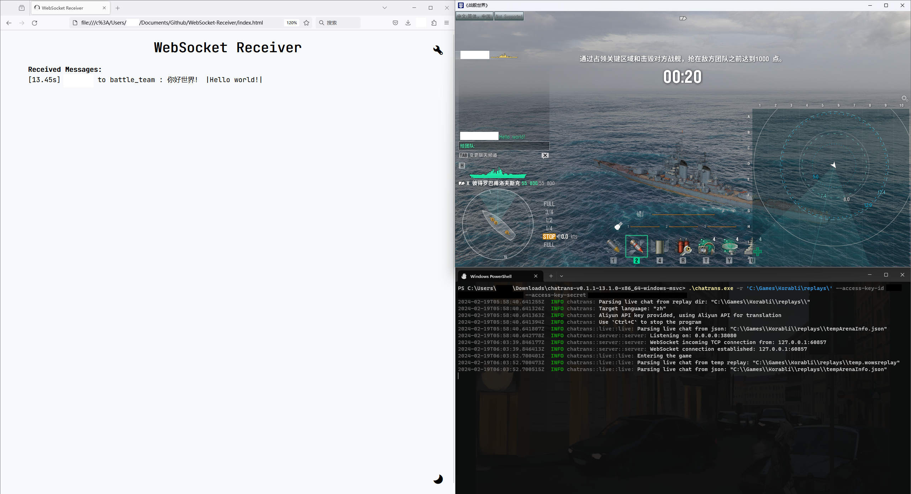

<div align="center">
    <h2 align="center">Chatrans</h2>
    <p align="center">
        A real-time chat interpreter for Korabli.
        <br />
        <br />
        <a href="https://github.com/Yusux/Korabli-chatrans/issues">Report Bug</a>
        ·
        <a href="https://github.com/Yusux/Korabli-chatrans/issues">Request Feature</a>
    </p>
</div>

## About The Project

This is a real-time chat interpreter for Korabli developed from [wows-replays](https://github.com/lkolbly/wows-replays). It gets the chat messages from the `temp.wowsreplay` and `tempArenaInfo.json` files in the `replays` folder under the game root directory, translates them to the selected language and sends the result to the client via a WebSocket server. The translation is done using the [Aliyun Translation API](https://www.aliyun.com/product/ai/alimt). 

For clients, any WebSocket client can be used to connect to the server. The messages are turned into strings by Chatrans before sending them to the client. A available client is [WebSocket-Receiver](https://github.com/Yusux/WebSocket-Receiver), which is a WebSocket receiving client in HTML. The demo of the client can be found [here](https://lab.yusux.xyz/WebSocket-Receiver). 


## Getting Started

The compiled Windows x86_64 executable can be found in the [releases](https://github.com/Yusux/Korabli-chatrans/releases) page. Choose the proper version and download the executable.

You can also compile the project yourself. The following instructions will help you to compile the project.

### Prerequisites

- rustc
  - Installation: [Rustup](https://rustup.rs/)
  - 1.76.0 (Stable, Windows and Linux) and 1.78.0 (Nightly, Linux) are tested.

### Compilation

1. Clone the repository.
    ``` sh
    git clone git@github.com:Yusux/Korabli-chatrans.git
    cd Korabli-chatrans
    ```
2. Compile the project.
    ``` sh
    cargo build --release
    ```
3. The compiled executable `chatrans.exe` will be found in `target/release/` directory.

## Usage

By using `chatrans.exe -h`, you can see the help message.

``` text
Usage: chatrans.exe [OPTIONS] --replay-dir <REPLAY_DIR>

Options:
  -r, --replay-dir <REPLAY_DIR>
          The replay dir to use
  -t, --target-language <TARGET_LANGUAGE>
          The target language, where `zh` stands for Chinese, `en` stands for English. Default is `zh` [default: zh]
  -i, --ip <IP>
          The server ip to use [default: 0.0.0.0]
  -p, --port <PORT>
          The server port to use [default: 38080]
      --access-key-id <ACCESS_KEY_ID>
          The Aliyun access key id
      --access-key-secret <ACCESS_KEY_SECRET>
          The Aliyun access key secret
  -h, --help
          Print help
  -V, --version
          Print version
```

### Serving with API

To enable the translation, you need to provide the access key id and access key secret of the [Aliyun Translation API](https://www.aliyun.com/product/ai/alimt).

> ([Pricing Docs from Aliyun](https://www.alibabacloud.com/help/en/machine-translation/product-overview/product-pricing)) Machine Translation is available in the universal edition and professional edition, and provides a free monthly quota of 1 million characters.

This should be enough for personal daily use. In this case, you can use the following command to start the server. Also, it is recommended to use sub accounts to avoid the risk of leaking the access key id and access key secret (no user data is collected by Chatrans). 

``` powershell
.\chatrans.exe -r 'path\to\replays' --access-key-id ACCESS_KEY_ID --access-key-secret ACCESS_KEY_SECRET
```


~~The game is installed on the C drive because I only have an SSD 😭, although that's not a huge problem. Please support me if you can, such as giving this repo a star.~~

Open the client and connect to the server. The messages will be sent to the client in real-time. The format of the messages is `[Time] Sender to Audience: Translated |Original|`.



### Serving without API

If you don't want to use the Aliyun Translation API, you can use the following command to start the server. The messages will be sent to the client without translation.

``` powershell
.\chatrans.exe -r 'path\to\replays'
```

Then on the website client, you can use an add-on called [Immersive Translate](https://immersivetranslate.com/) to translate the messages. The add-on is available on Chrome, Firefox, Edge and so on. It is recommended to set the original language to Russian in the add-on settings.


### Additional Notes

The client can be any WebSocket client, and can be opened on any device, such as a phone, a tablet, a computer, and so on, as long as it can connect to the server.

## Contributing

Any contributions you make are **greatly appreciated**. You can fork the project and make a pull request. Also, you can open an issue if you find a bug or want to request a feature.

## License

Distributed under the MIT License. See `LICENSE` for more information.
