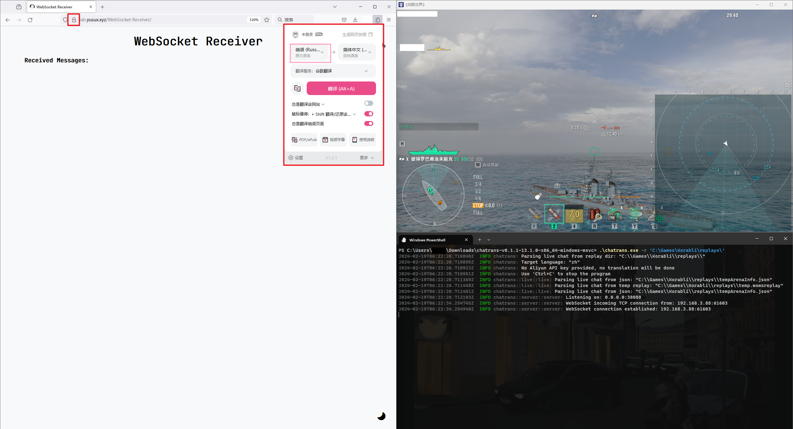

<div align="center">
    <h2 align="center">Chatrans</h2>
    <p align="center">
        船舶世界 Korabli 的实时聊天解释器
        <br />
        <br />
        <a href="https://github.com/Yusux/Korabli-chatrans/blob/main/README.md">English Document</a>
        ·
        <a href="https://github.com/Yusux/Korabli-chatrans/blob/main/docs/README_CN.md">中文文档</a>
        <br />
        <a href="https://github.com/Yusux/Korabli-chatrans/issues">Bug 反馈</a>
        ·
        <a href="https://github.com/Yusux/Korabli-chatrans/issues">功能请求</a>
    </p>
</div>

## 项目简介

这是一个从 [wows-replays](https://github.com/lkolbly/wows-replays) 开发的 Korabli 实时聊天解释器。它从游戏根目录下的 `replays` 文件夹中的 `temp.wowsreplay` 和 `tempArenaInfo.json` 文件中获取聊天消息，将其翻译为所选语言，并通过 WebSocket 服务器将结果发送到客户端。已经实现的翻译是使用[阿里云翻译 API](https://www.aliyun.com/product/ai/alimt) 完成的

对于客户端来说，任何 WebSocket 客户端都可以用来连接到服务器。这些消息在发送到客户端之前由 Chatrans 将其转换为字符串。可用的客户端是 [WebSocket-Receiver](https://github.com/Yusux/WebSocket-Receiver)，它是一个 HTML 格式的 WebSocket 客户端，用于接收 WebSocket 服务器推送的信息。客户端的演示可以在[这里](http://lab.rorin.cc/WebSocket-Receiver)找到。请注意，由于服务器使用的是 `ws` 而不是 `wss`，因此您应该使用 `http` 而不是 `https` 来访问网站客户端


### 待办事项

- [ ] 游戏内聊天消息的解释界面

## 开始使用

编译后的可执行文件可以在 [releases](https://github.com/Yusux/Korabli-chatrans/releases) 页面中找到。选择正确的版本并下载可执行文件，例如 `chatrans-v0.1.1-13.1.0-x86_64-windows-msvc.zip`

您也可以自己编译该项目，以下说明将帮助您编译该项目

### 前置需求

- rustc
  - 安装: [Rustup](https://rustup.rs/)

### 编译

1. Clone 该仓库
    ``` sh
    git clone git@github.com:Yusux/Korabli-chatrans.git
    cd Korabli-chatrans
    ```
2. 更新子模块
    ``` sh
    git submodule update --init --recursive
    ```
    > P.S. 这一部分是为了获取从游戏内解包出的 scripts 文件夹。我们在 [Korabli-scripts](https://github.com/Yusux/Korabli-scripts) 中提供了更新时正式服最新的 scripts，但是不能保证在服务器每次更新版本时准时更新。如果游戏版本更新后，上一版本的 Chatrans 不能正常使用，请优先尝试更新该子模块或者自行解包 scripts 并放置在 `addons/scripts` 文件夹下
3. 使用如下命令编译项目
    ``` sh
    cargo build --release
    ```
4. 编译后的可执行文件 `chatrans.exe` 将在 `target/release/` 目录中找到

## 使用方式

通过使用 `chatrans.exe -h`，您可以看到帮助消息

``` text
Usage: chatrans.exe [OPTIONS] --replay-dir <REPLAY_DIR>

Options:
  -r, --replay-dir <REPLAY_DIR>
          The replay dir to use
  -t, --target-language <TARGET_LANGUAGE>
          The target language, where `zh` stands for Chinese, `en` stands for English. Default is `zh` [default: zh]
  -i, --ip <IP>
          The server ip to use [default: 0.0.0.0]
  -p, --port <PORT>
          The server port to use [default: 38080]
      --access-key-id <ACCESS_KEY_ID>
          The Aliyun access key id
      --access-key-secret <ACCESS_KEY_SECRET>
          The Aliyun access key secret
  -h, --help
          Print help
  -V, --version
          Print version
```

### 在拥有 API 的情况下

要启用翻译，您需要提供[阿里云翻译 API](https://www.aliyun.com/product/ai/alimt) 的访问 access key id 和 access key secret

> ([机器翻译产品定价](https://help.aliyun.com/zh/machine-translation/product-overview/pricing-of-machine-translation)) 每月100万字符免费额度

这对于个人日常使用应该足够了。在这种情况下，您可以使用以下命令来启动服务器。另外，建议使用子账户，以避免泄露 access key id 和 access key secret 带来的风险（该项目不会收集用户数据）

``` powershell
.\chatrans.exe -r 'path\to\replays' --access-key-id ACCESS_KEY_ID --access-key-secret ACCESS_KEY_SECRET
```


打开客户端并连接到服务器，消息将实时发送到客户端。消息的格式为 `[时间] 发件人 to 接收者: 翻译 |原始语句|`


### 在没有 API 的情况下

如果您不想使用阿里云翻译 API，可以使用以下命令启动服务器。消息将在不翻译的情况下发送给客户端

``` powershell
.\chatrans.exe -r 'path\to\replays'
```

然后在网站客户端上，您可以使用名为 [沉浸式翻译](https://immersivetranslate.com/) 的插件来翻译消息。该插件适用于 Chrome、Firefox、Edge 等主流浏览器。建议在附加设置中将原始语言设置为俄语



### 额外说明

客户端可以是任何 WebSocket 客户端，可以在任何设备上打开，比如手机、平板、电脑等，只要能以 `ws` 协议连接到服务器即可

## 贡献该项目

**非常感谢您所做的任何贡献**。 您可以 fork 该仓库，修改后提交 pull request。此外，如果您发现错误或想要请求功能，您可以也可以提 [Issue](https://github.com/Yusux/Korabli-chatrans/issues)

## 许可

根据 MIT 许可证分发，有关更多信息，请参阅 [LICENSE](https://github.com/Yusux/Korabli-chatrans/blob/main/LICENSE)
